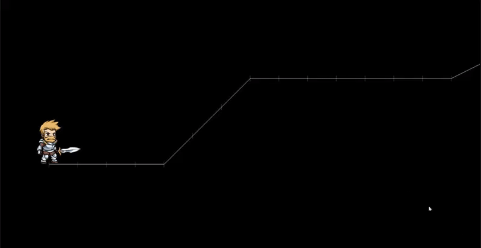

# Deus Vult

> Please note that I was still learning git with this project and so it's a bit of a mess!

## What is this?
I have a keen interest in making games without using mainstream game enignes, so I have been exploring SDL and SFML recently. This project was my first attempt to implement scripting into a game - I wanted to make an engine which could have its data serialised and manipulated with scripts rather than hard code.

This project uses [SFML](https://www.sfml-dev.org/) for the main game using the window and graphics modules. I then use [Sol2](https://github.com/ThePhD/sol2) for some bindings in lua. The result is that I have is the start of a game where scripts influence a lot of the game. I wanted to implement hotloading so that I could be editing a script and reloading it without recompiling or possibly even within the game itself.

The [Core folder](https://github.com/Crysikrend/Deus_Vult/tree/master/Core) is where I placed resources that I felt could be shared between multiple projects, whereas the [Game folder](https://github.com/Crysikrend/Deus_Vult/tree/master/Game) was for stuff I felt was pretty specific to the current game. the [Data folder](https://github.com/Crysikrend/Deus_Vult/tree/master/Data) is where you'll find the scripts. The most interesting scripts are located in the NPCs folder - I called him 'bruh'. There are two definitions for him, one which uses a spritesheet and one that uses the [Spine Animation Runtimes](http://esotericsoftware.com/), both which point to a script which is also in the same folder. The script details how the NPC will interact with the player when interacted with, or simply walked up to.

Learning Lua for this project was pretty fun and it was interesting to learn how to bind languages together.

